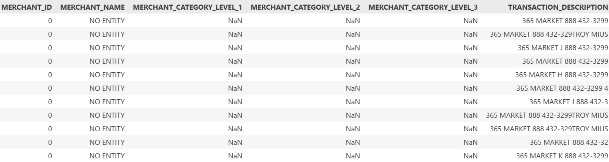
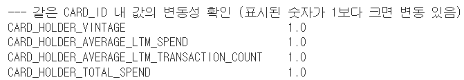
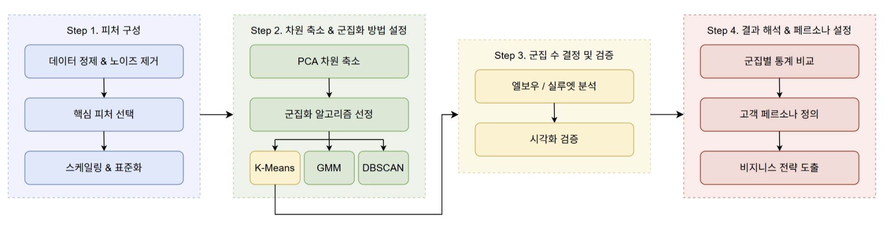
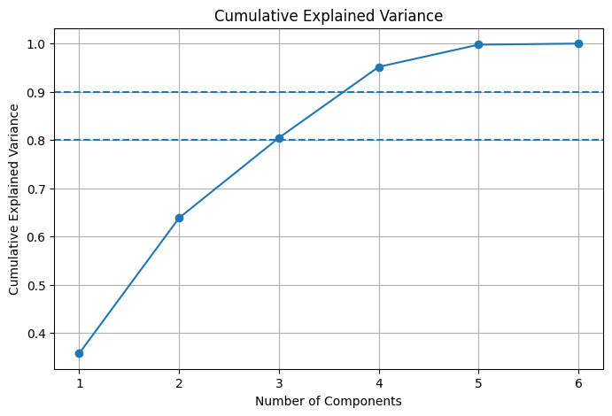
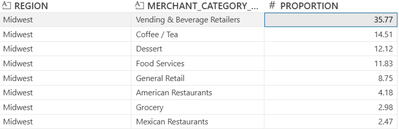
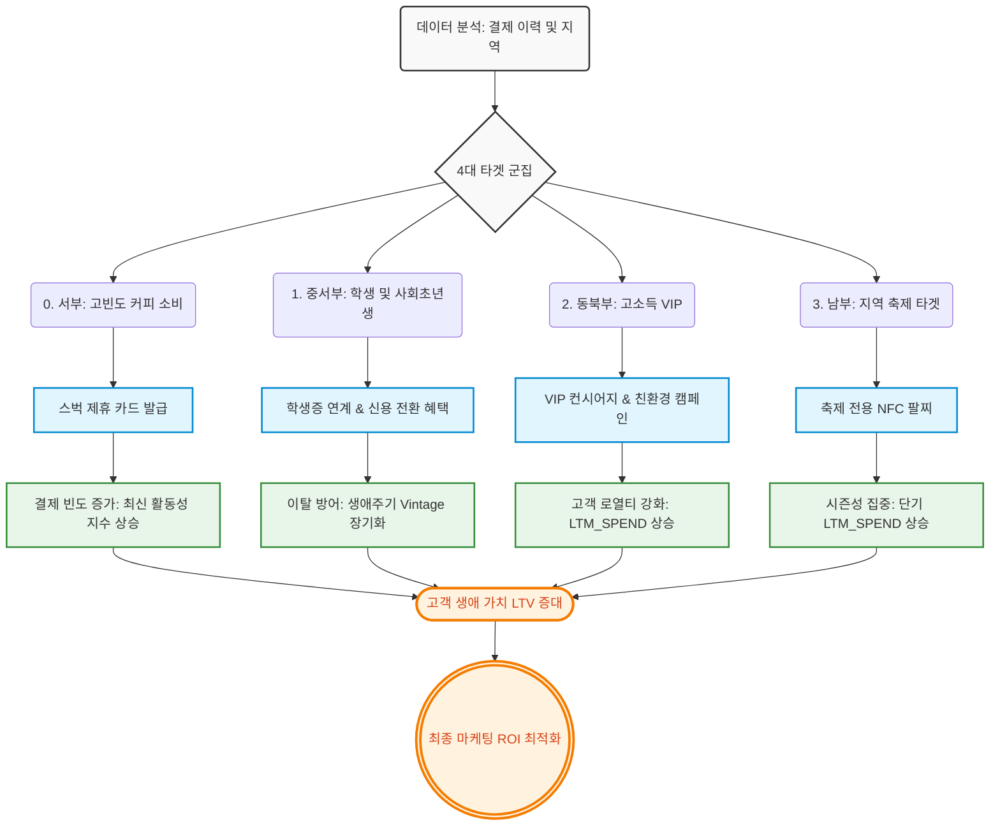

# 미가(味家) 발표 자료

<aside>
🔖

- 목차
</aside>

# 1. 데이터 전처리

## 1-1. 전처리 및 결측치 처리

<aside>

### **① ‘**365 MARKET’ in `TRANSACTION_DESCRIPTION`

`(MERCHANT_NAME == NO ENTITY)` & `(MERCHANT_CATEGORY_LEVEL 하나라도 비어 있음)` & **`(**TRANSACTION_DESCRIPTION**이 365 MARKET을 포함함)**` 기준으로 데이터를 분류하면 아래와 같음



- 365 MARKET이라는 설명문구가 포함되는 약 18.5만 개 행의 결측치를 보완
- 구글링을 통해 현실에 실제 있는 `365 Retail Markets` 라는 브랜드임을 확인
    - 실제로 `888-432-3299` 를 검색하면 해당 회사가 나옴: https://ramp.com/charge-finder/365-retail-markets
    - 사내 무인 매점/자판기 회사
- 이 점을 활용하여 **새로운 `MERCHANT_ID` 부여**
    - `MERCHANT_ID`: 기존에 사용되지 않던 숫자(3397)로 대체
    - `MERCHANT_NAME`: 365 RETAIL MARKETS
    - CANTEEN VENDING이라는 자판기 회사와 동일한 분류 체계를 사용
        - `MERCHANT_CATEGORY_LEVEL_1`: Restaurants and Food Services
        - `MERCHANT_CATEGORY_LEVEL_2`: Vending & Beverage Retailers
        - `MERCHANT_CATEGORY_LEVEL_3`: Vending & Beverage Retailers
</aside>

<aside>

### ② `MERCHANT_NAME` == ‘AVANTI MARKETS’

마찬가지로 무인 매점임을 확인 → ①과 동일한 체계로 분류

- `MERCHANT_CATEGORY_LEVEL_1`: Restaurants and Food Services
- `MERCHANT_CATEGORY_LEVEL_2`: Vending & Beverage Retailers
- `MERCHANT_CATEGORY_LEVEL_3`: Vending & Beverage Retailers
</aside>

<aside>

### ③ `MERCHANT_CATEGORY_LEVEL_*`

- 매핑 사전을 제작하여 결측치 보완
    - `TRANSACTION_DESCRIPTION`에 특정 단어가 포함되어 있으면, 그 단어를 기준으로 `MERCHANT_CATEGORY_LEVEL_*`를 선정
- 음식점 위주 데이터라는 점에 착안하여 음식과 관련된 카테고리를 선순위로 매핑
    - QSR Burgers → Coffee / Tea → … → Military Retailers → Airline Travel
- 예시
    - `TRANSACTION_DESCRIPTION`에 `burger` 혹은 `mcdonald` 포함 시 아래와 같이 대체
        - `MERCHANT_CATEGORY_LEVEL_1` ← `Restaurants and Food Services`
        - `MERCHANT_CATEGORY_LEVEL_2` ← `QSR`
        - `MERCHANT_CATEGORY_LEVEL_3` ← `QSR Burgers`
        
        ```python
        # 1. 햄버거
        (['burger', 'mcdonald', 'in-n-out', 'wendy', 'guys', 'freddy', 'habit', 'shack', 'sonic', 'swenson', 'culvers', 'carls'], 
        ('Restaurants and Food Services', 'QSR', 'QSR Burgers')),
        
        # 2. 피자
        (['pizza', 'pizzeria', 'domino', 'papa john', 'little cae', 'caesars'], 
        ('Restaurants and Food Services', 'QSR', 'Pizza Restaurants'))
        ```
        
</aside>

<aside>

### ④ `TRANSACTION_TYPE`

- `TRANSACTION_DESCRIPTION` == ‘THOMPSON MASTERPIECE PIZZ’
    
    → Spend로 직접 보완
    
</aside>

<aside>

### ⑤ 오프라인 결제 활용하여 `STATE/CITY` 보완

`CARD_PRESENT_INDICATOR`가 `Card Present`인 경우는 현실의 대면 결제이기 때문에 MERCHANT 위치와 TRANSACTION 위치가 동일한 게 무결성을 만족함

- 해당 경우에는 서로의 위치를 보충 가능
- 그러나 처리 전후 결과가 동일
    
    (혹시 몰라 가장 먼저 전처리를 진행했는데도 진행 전과 동일)
    

⇒ `TRANSACTION_위치`가 있으면 `MERCHANT_위치`도 잘 채워져 있다는 점을 확인

</aside>

<aside>

### ⑥ 결측치가 9개 이상인 행 제거

위 과정들을 거쳤음에도 한 행의 결측치가 9개 이상(전체 열의 1/3)인 행은 데이터가 잘못되었다 판단하여 제거 

</aside>

<aside>

### ⑦ `MERCHANT_STATE`

**ⅰ. `TRANSACTION_DESCRIPTION`이 동일한 집합이 모두 하나의 `MERCHANT_STATE`를 가리킨다면, 해당 집합의 결측치를 그 위치로 보완(유일 위치&nan의 조합)**

- MERCHANT_STATE가 존재하는 집합 추출
- 각각의 TRANSACTION_DESCRIPTION별 STATE가 몇 종류인지 확인
- TD당 STATE가 단 하나인 행들을 추출하여 매핑 사전 제작 후 결측치 대체

**ⅱ. `TRANSACTION_DESCRIPTION`에 ‘PedidosYa’가 있는 행**

- `TRANSACTION_DESCRIPTION`에 ‘PedidosYa’가 있으면서 `MERCHANT_STATE`가 결측이면, ‘NY’로 대체
    - `MERCHANT_STATE`가 존재하는 모든 행에 대해 `TRANSACTION_위치` 와 별개로 `MERCHANT_STATE`가 NY 나와 해당 로직 사용
    - 근소함: 64건
</aside>

<aside>

### ⑧ `CARD_HOLDER_AVERAGE_LTM_*`

**ⅰ. 가입 기간(Vintage) 기반 그룹 분리**

- `CARD_HOLDER_VINTAGE`를 기준으로 CARD_HOLDER 그룹 이원화
- LTM 변수는 최근의 12개월 활동을 기준으로 분류하고 있음
→ 가입 1년 미만과 1년 이상으로 구분하여 서로 다른 통계 접근법 적용

**ⅱ. 그룹별 맞춤 대체 로직**

- **VINTAGE < 12 : 신규 고객**
    - $\frac{전체\ 누적치}{가입\ 월수 + 1}$
    - 활동 기간이 1년 미만이므로, 현재까지의 전체 기록을 월평균으로 환산하여 적용
- **VINTAGE ≥ 12 : 기존 고객**
    - $\frac{최근\ 6개월\ 합계}{6}$
    - 최근 6개월간의 소비 패턴이 향후 1년을 대표할 가능성이 높다는 통계적 가정 활용
</aside>

<aside>

### ⑨ LTV식 제작 전처리 (카드별, 계정별 합산 과정)

- 동일 `CARD_ID`인 경우, 아래 컬럼들이 동일하다는 사실을 이용하여 전처리
    - 검증 코드
        
        ```python
        # 같은 CARD_ID 내에서 값이 몇 종류나 있는지 확인: nunique
        card_variation = df.groupby('CARD_ID').agg({
            'CARD_HOLDER_VINTAGE': 'nunique',
            'CARD_HOLDER_AVERAGE_LTM_SPEND': 'nunique',
            'CARD_HOLDER_AVERAGE_LTM_TRANSACTION_COUNT': 'nunique',
            'CARD_HOLDER_TOTAL_SPEND': 'nunique'
        })
        
        # 값이 변하는 카드(nunique > 1)가 얼마나 되는지 확인
        print("--- 같은 CARD_ID 내 값의 변동성 확인 (표시된 숫자가 1보다 크면 변동 있음)")
        print(card_variation.describe().loc['max'])
        ```
        
        
        
- `(ACCOUNT_ID, CARD_ID)` 쌍이 유일하게 존재하도록 중복 제거
- LTV식이 개인 사용자 단위로 집계됨에 따라 `ACCOUNT_ID` 기준으로 변수 정리
→  (한 고객의 여러 카드 사용에 대한 전처리)
    - `CARD_HOLDER_TOTAL_SPEND`, `CARD_HOLDER_TOTAL_TRANSACTION_COUNT` : SUM
    - `CARD_HOLDER_AVERAGE_LTM_SPEND`, `CARD_HOLDER_AVERAGE_LTM_TRANSACTION_COUNT` : SUM
    - `CARD_HOLDER_VINTAGE` : MAX
- 코드
    
    ```python
    # CARD_ID 단위 중복 제거
    card_unique = df.drop_duplicates(subset=['ACCOUNT_ID', 'CARD_ID']).copy()
    
    # ACCOUNT_ID 단위 맞춤 집계
    user_df = card_unique.groupby('ACCOUNT_ID').agg({
        'CARD_HOLDER_TOTAL_SPEND': 'sum',
        'CARD_HOLDER_TOTAL_TRANSACTION_COUNT': 'sum',
        'CARD_HOLDER_AVERAGE_LTM_SPEND': 'sum',
        'CARD_HOLDER_AVERAGE_LTM_TRANSACTION_COUNT': 'sum', # LTM 빈도 합산
        'CARD_HOLDER_VINTAGE': 'max' # 가장 오래된 카드 기준
    }).reset_index()
    ```
    
</aside>

## 1-2. 파생변수 생성

<aside>

### ① `TRANSACTION_DATE` 관련 파생변수 - LOCAL TIME

**ⅰ. `TRANSACTION_STATE` 기반의 타임존 매핑**

- 단순 UTC 기준이던 `TRANSACTION_DATE` → **DST**(STATE별 시간대 반영) 기준 `LOCAL_TIME` (부록 참고)
- 각 주의 서머타임을 고려하여 적용
- 매핑되지 않는 지역은 가장 상권이 큰 동부 표준시(`America/New_York`)로 기본값 부여

**ⅱ. 관련 파생변수 생성**

- `LOCAL_TIME`: 현지 날짜/시간
- `Hour`: 시간대 (0-23시)
- `DayOfWeek`: 요일 정보
- `TZ_NAME`: 타임존 정보(`America/New_York`, `America/Chicago` 등)
</aside>

<aside>

### ② `STATE/CITY` 관련 파생변수 - CENSUS REGION Mapping

.png)

- 미국 인구조사국(Census Bureau) 기준을 활용하여 `동북부/중서부/남부/서부`로 구분
- 매핑 사전을 이용하여 필요에 따라 `MERCHANT`, `TRANSACTION`, `CARD_HOLDER`에 적용 가능
</aside>

<aside>

### ③ 원본 결측치 보존 및 지표 설계

**ⅰ. 원본 결측치 보존**

- `ACCOUNT_ID`: 이런저런 시도를 해봤으나, 결측치를 채우지 않는 게 낫다고 판단. `CARD_ID`별로 구분이 가능하므로 원본 데이터 보존
- `TRANSACTION_DESCRIPTION`: 채우지 않고 활용만 진행

**ⅱ. 지표 설계**

<aside>

### ***INSIGHT FINANCIAL’s LTV Formula***

$$
LTV = LTM\_spend \times 유지기간 \times 0.02 \times\left(\frac{LTM\_spend}{\frac{total\_spend}{vintage}}\right)
$$

</aside>

- **LTV 공식 설계 이유**: 고객생애가치(LTV)를 높일 수 있는 회사의 전략을 위해 제한된 데이터 내에서 최적의 LTV 계산법 수립
</aside>

# 2. 군집화 과정

## 2-0. Clustering Analysis Workflow



**2-1. 피처 구성** - 군집화에 사용할 데이터의 피처 구성

**2-2. 차원 축소 & 군집화 방법 설정** - 데이터의 특성과 분석 목적에 적합한 방법 선정

**2-3. 군집 수 결정 및 검증** - 최적 군집 수 탐색 및 분리 수준 검증

**2-4. 결과 해석** - 군집별 주요 특성 비교 및 고객 유형 해석

---

## **2-1. 피처 구성**

<aside>

### ① 분석 단위 설정

먼저 LTV 상승 목표에 따라 거래 데이터의 분석 단위를 **고객(Account)** 단위로 설정

→ 같은 `ACCOUNT_ID`에 속한 거래들을 하나로 묶어, 고객별 소비 특성을 대표하는 요약 지표 생성

</aside>

<aside>

### ②  `ACCOUNT_ID` 별 핵심 지표 생성

각 고객에 대해 다음 5개의 핵심 지표를 추출

| **지표** | **활용한 컬럼** | 설명 |
| --- | --- | --- |
| TOTAL_SPEND | `CARD_HOLDER_TOTAL_SPEND` | 해당 고객의 전체 거래 금액 합계 |
| **VINTAGE** | `CARD_HOLDER_VINTAGE` | 고객의 최초 거래 시점부터 기준 시점까지의 경과 기간(개월) |
| AVG_TICKET | `CARD_HOLDER_TOTAL_SPEND` / `CARD_HOLDER_TOTAL_TRANSACTION_COUNT`  | 평균 결제 단가  |
| RECENCY_DAYS | `TRANSACTION_DATE`  | 기준 시점(2024년 7월 1일)에서 마지막 거래일까지의 경과 일수 |
| ACTIVITY | `CARD_HOLDER_AVERAGE_LTM_SPEND` 
`CARD_HOLDER_AVERAGE_LTM_TRANSACTION_COUNT` | 최근 12개월 평균 지출액 및 평균 거래 횟수 |
</aside>

<aside>

### ③ 고객 피처 테이블 구성

위에서 만든 5개 지표를 바탕으로, `ACCOUNT_ID` 별로 한 행을 가지는 고객 특성 데이터셋 구축

</aside>

<aside>

### ④ 왜도 완화를 위한 로그 변환

<aside>

**WHY?**

- 고객 지표들은 분포가 비대칭적인 경우가 많음
    
     (ex. 총 소비액이나 평균 단가는 일부 고객에 매우 큰 값을 가져 오른쪽으로 긴 꼬리 분포를 보일 수 있음)
    
- 이러한 왜곡을 줄이기 위해 주요 변수들에 **로그 변환(log1p)** 적용
</aside>

- **적용 대상**: `TOTAL_SPEND`, `AVG_TICKET`, `AVG_LTM_SPEND`, `AVG_LTM_TXN_COUNT`
- **적용 목적**
    - 극단값 영향 완화 및 변수 분포 안정화
    - 군집화 과정에서 특정 변수의 과도한 영향 방지
</aside>

<aside>

### ⑤ 변수 스케일링

<aside>

**WHY?**

- 각 변수는 단위와 범위가 다르기 때문에 그대로 군집화에 사용하면 특정 변수의 영향이 지나치게 커질 수 있음
- 로그 변환 후 **표준화(Standard Scaling)** 수행 → 모든 변수를 평균 0, 표준편차 1 수준으로 맞춤
</aside>

- **적용 목적**
    - 변수 간 크기 차이 제거
    - 거리 기반 알고리즘에서 변수 편중 방지
    - PCA와 군집화 성능 안정화
</aside>

---

## 2-1. **차원 축소 & 군집화 방법 설정**

<aside>

### ①  PCA

<aside>

**WHY?**

- 앞서 전처리한 5개 지표는 서로 상관관계를 가질 수 있음
(ex. 총 소비액과 평균 단가는 일정 부분 함께 움직일 수 있음)
- 중복 정보를 줄이고 데이터 구조를 보다 효율적으로 파악하기 위해 **PCA(주성분 분석)** 적용
</aside>

- **적용 목적**
    - 고차원 정보를 더 적은 축으로 압축
    - 노이즈 감소 및 시각화 용이성 확보
    - 군집 구조를 더 명확하게 파악



**<설명분산 비율 확인>**

누적 설명분산을 검토한 결과, 4개의 주성분에서 약 95%의 설명력을 확보

→ 최종 **주성분 개수를 4개로 선정**


**<주성분별 변수 적재치(Loadings)>**

| 주성분 | 지표 | 해석 |
| --- | --- | --- |
| PC1 | Activity (활동성) | LTM 소비액과 거래횟수를 주로 반영 |
| PC2 | TOTAL_SPEND | 총 소비 규모와 평균 결제단가 중심으로 전반적인 소비 크기 설명 |
| PC3 | Recency (최근성) | 최근성을 거의 단독으로 반영 |
| PC4 | AVG_TICKET, VINTAGE | 평균 결제단가와 유지기간을 반영 |
</aside>

<aside>

### ② 군집화 방법 설정

<aside>

**WHY?**

- 서로 구분되는 연속형 좌표 공간으로 데이터 정리
- 군집 중심(centroid)을 기준으로 유사한 고객을 분류하는 **K-means를 적용하기에 적합하다**고 판단(각 축의 해석 가능성 확보)
</aside>

- **K-means**
    - 거리 기반으로 군집을 형성하므로, 전처리와 PCA를 거친 현재 데이터 구조와 일치
    - 군집별 중심값을 통해 각 고객군의 특성을 직관적으로 설명 가능
    - 서로 겹치지 않는 몇 개의 명확한 세그먼트로 고객을 구분하는 것이 목적이므로 실무적 해석과 활용 측면에서 더 적절
</aside>

---

## 2-3. **군집 수 결정 및 검증**

<aside>

### ① 최적 군집 수 탐색 및 결정

적절한 군집 수(K)를 결정하기 위해 **엘보우 메소드(Elbow Method)**를 활용 


- 군집 내 제곱합(Inertia)의 변화를 확인
    - k=4까지는 Inertia가 비교적 큰 폭으로 감소하였으나, 그 이후부터는 감소 폭이 점차 완만해지는 경향이 나타남
- 군집 수를 지나치게 늘리지 않으면서도 데이터의 주요 구조를 효과적으로 반영할 수 있도록 **최적 군집 수를 4개로 선정**
</aside>

<aside>

### ② 군집화 수행

선정된 **k=4**를 바탕으로 **K-means 군집화**를 적용하여 고객 세그먼트를 도출 

| Cluster | count | ratio(%) |
| --- | --- | --- |
| 0 | 465,002 | 12.73 |
| 1 | 1,241,529 | 33.98 |
| 2 | 960,944 | 26.30 |
| 3 | 985,972 | 26.99 |


**군집 시각화 2D**


**군집 시각화 3D**


**군집별 PCA 점수**

| Cluster | PC1 | PC2 | PC3 | PC4 |
| --- | --- | --- | --- | --- |
| 0 | **-3.359147** | -0.898348 | -0.162210 | 0.297330 |
| 1 | **0.883025** | -0.824294 | -0.514681 | 0.019925 |
| 2 | -0.038875 | **1.351595** | -0.299864 | -0.539135 |
| 3 | 0.510223 | 0.144336  | **1.016835** | 0.360134 |
</aside>

<aside>

### ③ 유효성 검증

유효성 검증을 위해 실루엣 계수(Silhouette Score)를 활용

- **Silhouette Coefficient**: 0.2514
    - 군집 간 분리가 매우 강한 수준은 아니지만, 실제 고객 소비 데이터의 특성상 군집 간 경계가 일부 겹칠 수 있음을 고려할 때 완전히 비합리적인 결과로 보기는 어려움
    - 엘보우 메소드를 통해 군집 수를 선정하였고, PCA 결과 각 축의 해석 가능성과 군집별 규모의 분포를 함께 검토하였을 때, **k=4를 고객 세분화 목적에 부합하는 실용적인 군집 수**로 판단
</aside>

---

## **2-4. 결과 해석**

<aside>

### ① 군집별 주요 특성

#### **ⅰ. Cluster 0 (12.73%):** **장기보유 저활동 전환형**

- 설명
    - 핵심 주성분 )
    PC1이 매우 낮고, PC2도 낮은 편임
    - 분석 )
        - **VINTAGE가 높음**
            - 평균 54.8, 중앙값 57로 장기 보유 고객 비중이 높음
        - **누적 소비 규모는 일정 수준 이상**
            - TOTAL_SPEND 평균 136,827, 중앙값 76,515
            - 누적 거래횟수도 높은 편임
        - **최근 1년 활동성은 매우 낮음**
            - AVG_LTM_SPEND, AVG_LTM_TXN_COUNT가 거의 0에 가까움
            - PC1이 압도적으로 낮아 최근 활동성이 가장 약한 군집으로 해석됨
    - 과거에는 일정 수준 이상 거래했으나, 최근 1년 활동이 크게 둔화된 **장기보유 저활동 전환 고객군**

#### **ⅱ. Cluster 1 (33.98%): 젊은 소액 일상활동형**

- 설명
    - 핵심 주성분 )
    PC1은 높고, PC2는 낮음
    - 분석 )
        - **최근 1년 활동성은 높음**
            - PC1이 높아 최근 1년 소비 및 거래 활동이 활발한 군집으로 해석됨
            - 최근 1년 거래횟수도 높은 편임
        - **누적 규모와 고객 기간은 짧음**
            - PC2가 낮아 누적 소비 규모와 빈티지는 상대적으로 낮음
            - VINTAGE 평균 22.2, 중앙값 19로 고객 유지기간이 가장 짧은 편임
        - **소액 결제 중심 패턴**
            - AVG_TICKET이 최저 수준(평균 33.9, 중앙값 31.2)
            - TOTAL_SPEND도 전체 군집 중 가장 낮음
        - **최근성은 가장 우수**
            - RECENCY 평균 53일, 중앙값 48일로 최근 이용성이 가장 좋음
        - **젊은 고객 비중이 높음**
            - Gen Z 비율이 높아, 일상적이고 가벼운 소비 패턴을 보이는 젊은 고객층 중심 군집으로 해석 가능함
    - 최근 활동은 활발하지만 객단가와 누적 규모는 낮은 **젊은 소액 일상활동 고객군**

#### ⅲ. Cluster 2 (26.30%): 장기 우량 핵심고객형

- 설명
    - 핵심 주성분 )
    PC2가 가장 높고, 전반적인 고객가치 지표가 최상위 수준임
    - 분석 )
        - **누적 규모와 고객가치가 가장 큼**
            - PC2가 가장 높아 장기적 관점의 소비 규모와 고객가치가 가장 우수한 군집으로 해석됨
            - TOTAL_SPEND 최고: 평균 279,411, 중앙값 123,370
        - **고객 유지기간이 가장 김**
            - VINTAGE 최고: 평균 60.0, 중앙값 62
            - 누적 거래횟수도 가장 높음
        - **최근 1년 활동도 가장 우수함**
            - AVG_LTM_SPEND, AVG_LTM_TXN_COUNT 모두 높음
            - 최근까지도 지속적으로 이용하는 핵심 고객군으로 볼 수 있음
        - **최근성도 안정적**
            - RECENCY도 나쁘지 않아, 과거 실적뿐 아니라 현재 활동성도 유지되고 있음
    - 장기간 유지되면서 누적 소비와 최근 활동 모두 우수한 **장기 우량 핵심 고객군**

#### ⅳ. Cluster 3 (26.99%): 최근 둔화 이탈위험형

- 설명
    - 핵심 주성분 )
    PC1은 양수이나, PC3가 가장 높음
    - 분석 )
        - **최근 1년 활동성은 일정 수준 존재**
            - PC1이 양수이므로 최근 1년 소비와 거래는 어느 정도 유지되고 있음
            - AVG_LTM_SPEND, AVG_LTM_TXN_COUNT도 비교적 높은 편임
        - **최근성 악화가 가장 두드러짐**
            - PC3가 가장 높아 최근성 저하가 가장 뚜렷한 군집으로 해석됨
            - RECENCY 평균 131일, 중앙값 135일로 최근 이용이 가장 뜸함
        - **누적 규모는 최상위는 아님**
            - TOTAL_SPEND와 VINTAGE는 Cluster 2, Cluster 0보다 낮음
            - 장기 핵심 고객이라기보다는, 일정 수준 소비 이력이 있으나 최근 이용이 줄어든 군집에 가까움
        - **객단가는 상대적으로 높음**
            - AVG_TICKET은 가장 높지만, 차이가 매우 큰 수준은 아님
    - 과거/최근 1년 활동 이력은 있으나, 최근 접점이 약해지고 있어 관리가 필요한 **이탈 위험 고객군**
</aside>

<aside>

### ② 고객 유형 요약

| **클러스터** | **주요 특징** | **소비/활동 특성** |
| --- | --- | --- |
| **Cluster 0 (12.73%)
장기보유 저활동 전환형**  | VINTAGE와 누적 소비액은 높은 편이나, 최근 1년 평균 소비와 거래활동은 매우 낮음 | 과거에는 일정 수준 이상 이용했으나 최근 활동성이 크게 둔화된 고객군 |
| **Cluster 1 (33.98%)
젊은 소액 일상활동형**  | 최근성 가장 우수, 최근 1년 활동성 높음, 객단가와 누적 소비 규모는 가장 낮음 | 소액·빈번한 일상 소비 중심의 젊은 활동 고객군 |
| **Cluster 2 (26.30%)장기 우량 핵심고객형**  | TOTAL_SPEND, VINTAGE, 최근 1년 평균 소비·거래 모두 가장 높음 | 장기간 유지되며 현재도 활발히 이용하는 핵심 고가치 고객군 |
| **Cluster 3 (26.99%)
최근 둔화 이탈위험형**  | 최근 1년 활동은 존재하나 RECENCY가 가장 나쁨, 객단가는 비교적 높음 | 소비 여력은 있으나 최근 이용 빈도가 줄어든 이탈 위험 고객군 |
</aside>

# 3. 추가 분석

## 3-1. Lift 분석 방법론

전통적인 연관분석 알고리즘 대신, **Lift라는 지표의 개념**을 차용하여 **기댓값 대비 실제 관측값의 비율을 관찰하자**는 방법론을 활용함

<aside>

### ① 방법론 비교

**ⅰ. 전통적인 연관분석**

- A를 구매하면 B도 구매함
- `lift(A → B) = P(A와 B가 함께 등장) / (P(A)) * (P(B))`
- $Lift(A \rightarrow B) = \frac{P(A \cap B)}{P(A) \cdot P(B)}$
- Apriori/FP-Growth 등 연관분석 알고리즘 사용
- 데이터의 한계로 `ACCOUNT_ID` 기반으로는 제대로 된 basket 마련이 어려움

**ⅱ. Lift 분석 방법론**

- 집단별 소비 비율과 전체 평균 비율의 비(比)인 Lift를 직접 계산하는 방법론
- 특정 집단 C는 전국 평균과 비교했을 때 어떤 업종 D를 유독 많이 소비하는가?
- `lift = 집단 내 실제 비율 / 전국 평균 비율(기댓값)`
</aside>

<aside>

### ② Basket 및 Item 정의

- A를 구매하면 B도 구매함
- `lift(A → B) = P(A와 B가 함께 등장) / (P(A) × P(B))`
- 데이터의 한계로 `ACCOUNT_ID` 기반 제대로 된 basket 마련이 어려움
- Apriori/FP-Growth 등 연관분석 알고리즘 사용

**ⅰ. Basket**

- `CENSUS_REGION` (이하 `REGION`)
- `REGION` x `Cluster_*`

**ⅱ. Item**

- `MERCHANT_CATEGORY_LEVEL_3` (이하 `MCL3`)
- `MCL3` x `MERCHANT_NAME`
- Basket과 Item은 원하는 방향에 따라 다양한 조합으로 설정할 수 있음
</aside>

<aside>

### ③ Lift 기반 소비 분석

$$
Lift  =  \frac{집단\ 내\ 실제\ 비율}{전체\ 평균\ 비율(기댓값)}
$$

| **Lift 값** | **해석** |
| --- | --- |
| Lift < 1.0 | 전국 평균보다 해당 MCL3 소비 비율이 낮음 |
| Lift == 1.0 | 전국 평균과 동일한 소비 비율 |
| Lift > 1.0 | 전국 평균보다 해당 MCL3 소비 비율이 높음 |

**ⅰ. 전국 평균 비율(기준 설정)**

- 아무런 집단 특성이 없을 때 기대되는 비율

**`local_ratio(Basket, Item)** **=** 해당 Basket 전체에서 Item 거래 수 **/** 해당 Basket 전체 거래 수`

**`global_ratio(Item) =** 전체 데이터에서 해당 Item 거래 수 **/** 전체 거래 수` 

**ⅱ. 조합 1: `REGION` + `MCL3`** 

- REGION 그룹이 전국 평균보다 특정 MCL3를 얼마나 더 결제했는지

→ **`lift(REGION, MCL3)** **= local_ratio(**REGION, MCL3**)** **/ global_ratio(**MCL3**)`** 

**ⅲ. 조합2 : (`REGION` x `Cluster_*`)+ (`MCL3` x `MERCHANT_NAME`)**

- 지역X군집 조합별로 업종X가맹점 조합을 전국 평균보다 얼마나 더 소비했는지

→ **`lift((REGION x Cluster_*), (MCL3 x MERCHANT_NAME))** **= local_ratio(**REGION **x** Cluster_*, MCL3 **x** MERCHANT_NAME) **/** **global_ratio(**MCL3 **x** MERCHANT_NAME**)**`

</aside>

---

## 3-2. 회귀 분석 (LTV 높이는 고객 특성 파악용)

- **`LTV(고객생애가치)`** = 최근 12개월 평균 결제금액  X  유지기간  X  2%  X  최신성 지수

$$
LTV = (LTM\_SPEND \times Vintage \times 0.02) \times \frac{LTM\_SPEND}{Total\_Spend / Vintage}
$$

<aside>

### ① 목적

LTV(고객생애가치)를 높이는 요소들을 찾기 위함

- LTV 계산과 직접적으로 연관되는 고객의 누적 결제금액, 결제횟수 등의 데이터는 제외
- 고객의 소비패턴, 인구통계학적 속성과 같은 요인만 가지고 회귀식 정의
- 변수별 회귀계수를 확인하여 어떤 변수가 LTV를 높이는지 확인하고자 함
</aside>

<aside>

### ② 변수 정리

#### **y값(종속변수) - LTV**

- `LTV(고객생애가치)` = 최근 12개월 평균 결제금액 X 유지기간 X 2% X 최신성 지수
    
    $LTV = (LTM\_SPEND \times Vintage \times 0.02) \times \frac{LTM\_SPEND}{Total\_Spend / Vintage}$
    
    - 최근 결제 금액에 더 큰 비중을 둔 LTV 계산
        
        *(최신 활동성 지수: 최근 1년 소비액이 과거 평균 소비액보다 클수록 1 이상의 가중치가 붙어 LTV가 증폭됨)*
        
    - (ACCOUNT_ID 별로 계산)
    - 2%의 의미
        - 카드사 입장에서 수수료 2%에 대한 수익 계산
        - WHY 수수료만 LTV 식에 포함?
            - 연회비도 카드사 입장 수익
            - 카드사에서 제공하는 혜택들(캐시백, 쿠폰 등 서비스)은 비용
            
            → 이 둘이 상쇄되어 0이 된다고 가정하고 수수료만을 우리 LTV식에 포함
            

#### X값(독립변수) - 고객의 소비패턴, 인구통계학적 속성

**ⅰ.  카드 종류**

`CREDIT_RATIO` : 신용카드 사용 비중(클수록 신용카드 메인, 작을수록 체크카드 메인)

**ⅱ. 지역**

`REGION_*` : 미국을 4개 지역으로 나눔(서부/중서부/동북부/남부)

**ⅲ. 시간**

`WEEKEND_RATIO` : 주중/주말 카드 사용 비중 (주말에 더 많은 금액을 사용할수록 높아짐)

`LUNCH_RATIO` : 점심 결제 비중

`DINNER_RATIO` : 저녁 결제 비중

**ⅳ. 결제패턴(온/오프라인)**

`OFFLINE RATIO` : 오프라인 결제 비중 (오프라인에서 많이 결제할수록 높아짐, CRAD_PRESENT_INDICATOR 사용)

**ⅴ. 세대**

`GENERATION_*` : 세대 정보 5가지로 나타낸 범주형 변수

**ⅵ. 고객 분류**

`SHOPPER_CLASSIFICATION_*` : 0,1,2로 구분된 기존 고객 분류 정보

**ⅶ. 혼합변수(시너지 효과 확인)**

`LUNCH_RATIO OFFLINE_RATIO` : 점심비중 X 오프라인 비중

`DINNER_RATIO OFFLINE RATIO` : 저녁비중 X 오프라인 비중

`WEEKEND_RATIO OFFLINE_RATIO` : 주말비중 X 오프라인 비중

`WEEKEND_RATIO LUNCH_RATIO` : 주말비중 X 점심비중

`WEEKEND_RATIO DINNER RATIO` : 주말비중 X 저녁비중

`LUNCH_RATIO DINNER_RATIO` : 점심비중 X 저녁비중

`LUNCH_RATIO CREDIT_RATIO` : 점심비중 X 신용카드비중

`WEEKENT_RATIO CREDIT_RATIO` : 주말비중 X 신용카드비중

`DINNER_RATIO CREDIT_RATIO` : 저녁비중 X 신용카드비중

`OFFLINE_RATIO CREDIT_RATIO` : 오프라인 비중 X 신용카드 비중

**ⅷ. 제곱 변수(비선형성 반영)**

특정 행동이 과도하게 많아질 경우 LTV에 미치는 영향 파악

`OFFLINE_RATIO^2` : 오프라인 결제 편중도 (오프라인에서만 극단적으로 결제가 많으면 LTV가 어떻게 되는지)

`LUNCH_RATIO^2` : 점심 결제 편중도 (다른 시간말고 점심에만 극단적으로 결제가 많으면 LTV가 어떻게 되는지)

`DINNER_RATIO^2` : 저녁 결제 편중도 (다른 시간말고 저녁에만 극단적으로 결제가 많으면 LTV가 어떻게 되는지)

`WEEKEND_RATIO^2` : 주말 결제 편중도 (주말에만 극단적으로 결제가 많으면 LTV가 어떻게 되는지)

`CREDIT_RATIO^2` : 신용카드 결제 편중도 (신용카드 결제만 극단적으로 많으면 LTV가 어떻게 되는지)

</aside>

<aside>

### ③ 사용한 모델

선형회귀로는 LTV 예측에 한계가 있고, 선형 회귀의 6가지 가정 충족이 어려운 점을 고려

→ 비선형회귀 중 **다항식 회귀 모델** 활용

</aside>

<aside>

### ④ 회귀 결과

<aside>

📌 $R^2$ 수치는 낮지만, 이 분석은 LTV의 정확한 수치 예측보다는 LTV를 견인하는(또는 저해하는) 고객의 특정 행동 패턴을 찾아내어 마케팅 타겟팅의 근거로 활용하는 것에 목적이 있음

</aside>

### **LTV 다항 회귀 분석 결과 (R² = 0.0421)**

### **📈 LTV 상승 견인 요인 (Top 3)**

| **순위** | **변수명 (Feature)** | **회귀 계수 (Coefficient)** | **비즈니스 의미** |
| --- | --- | --- | --- |
| **1** | `DINNER_RATIO` | 0.4974 | 저녁 결제 비중이 높을수록 LTV가 가장 강하게 상승함 |
| **2** | `OFFLINE_RATIO^2` | 0.3835 | 오프라인 결제에 극단적으로 편중된 고객은 VIP 잠재력을 가짐 |
| **3** | `WEEKEND_RATIO` | 0.3557 | 평일 생활비에 더해 주말 여가/쇼핑까지 카드를 쓰는 고객의 가치가 높음 |
- **오프라인** 결제 비중이 높은 고객들의 충성도를 유지하는 전략 필요
- **저녁**과 **주말** 소비를 촉진시키는 전략이 LTV를 높이는 방향

### **📉 LTV 하락 위험 요인 (Bottom 5)**

| **순위** | **변수명 (Feature)** | **회귀 계수 (Coefficient)** | **비즈니스 의미** |
| --- | --- | --- | --- |
| **1** | `WEEKEND_RATIO^2` | -0.3512 | 주말 체리피커. 평일엔 안 쓰고 주말 혜택만 받는 극단적 소비의 위험성 |
| **2** | `OFFLINE_RATIO` | -0.2972 | 온/오프라인을 섞어 쓰는 고객의 이탈률이 높음 |
| **3** | `DINNER_RATIO^2` | -0.2628 | 밥 먹을 때만 가끔 꺼내는 서브(Sub) 카드 유저 |
| **4** | `CREDIT_RATIO` | -0.2222 | (하단 상세 해석 참조) |
| **5** | `CREDIT_RATIO^2` | -0.2222 | 신용카드에만 극단적으로 의존하는 고객의 낮은 LTV 구조 |
- 혜택을 쫓아 신용카드만 쓰는 사람들은 체리피커 성향이 강하거나, 여러 카드를 돌려 막는 유저일 확률이 높음
- `CREDIT_RATIO` 의 회귀계수가 마이너스라는 것은, **일상의 대부분의 소비에 우리 회사의 체크카드(Debit)를 이용하는 고객**이 LTV가 높다는 뜻
</aside>

<aside>

### **⑤  결과 한눈에 정리**

- 빨간색이 LTV 하락, 파란색이 LTV 상승 요인


- **참고) 소비패턴에 의한 고객분류**
    
    
    | **LTV 기여도** | **균형 잡힌 소비 스타일
    (평일/주말, 온/오프라인 골고루 소비)** | **특정 행동 편중 소비
    (Ratio², 특정 목적만 편중 소비)** |
    | --- | --- | --- |
    | **높은 LTV 영향 (+)**
    *(가치 견인 및 증폭)* | **Golden Behaviors**
    • `DINNER_RATIO`, `WEEKEND_RATIO`
    • 일상의 기본기가 확실하면서 저녁과 주말의 여유를 우리 카드로 해결하는 가장 이상적인 우량 고객 | **Loyal Specialists**
    • `OFFLINE_RATIO²`
    • 온라인 배달/쇼핑을 거의 사용하지 않고, 오직 오프라인 현장 결제에만 몰입하는 확고한 충성 고객 |
    | **낮은 LTV 영향 (-)**
    *(가치 저해 및 하락)* | **Misaligned Spenders**
    • `OFFLINE_RATIO`, `CREDIT_RATIO`
    • 일상적으로 결제는 하지만, 당사 혜택과 소비 패턴이 어설프게 매핑되어 이탈률이 높거나 마진이 낮은 위험 구간. | **Cherry-Pickers**
    • `WEEKEND_RATIO²`, `DINNER_RATIO²`, `CREDIT_RATIO²`
    • 평일엔 한 푼도 안 쓰다가 주말/저녁 혜택만 쏙 빼먹는 비구조적 유저 |
</aside>

# 4. 미국 지역 유형 성격(서부, 중서부, 동북부, 남부)

## **4-1. 미국** **지역별 특징**


- `CARD_HOLDER_STATE` 사용

<aside>
🤗

**서부** : 노란색 (캘리포니아)

**중서부** : 초록색 (미시간, 일리노이, 오하이오)

**동북부** : 주황색 (뉴욕, 버몬트)

**남부** : 파란색 (텍사스, 플로리다)

</aside>

<aside>

### **① 서부**

.png)

**lift & count 분석 `MERCHANT_LV_3` 기준**

.png)

**거래 비중 분석 `MERCHANT_NAME` 기준**

 **ⅰ. 높은 스타벅스 소비량 (온라인, 오프라인)**

- 서부의 캘리포니아(CA)에는 스타벅스 매장이 3,039개가 존재
    - 이는 미국 전체 매장의 18%퍼센트로 압도적인 수 
     https://www.scrapehero.com/location-reports/Starbucks-USA/
- 실리콘밸리 근처 직장인 및 대학생은 커피를 활발히 소비

 **ⅱ. 건강, 취향을 중시하는 서부의 라이프스타일**

- 인종 다양성 : 서부 지역은 아시아계 미국인과 히스패닉 인구 비율이 가장 높은 지역
- 멕시칸 푸드 중에서 “패스트 캐주얼(패스트푸드보다 고급**)**” 형식의 치폴레가 인기
- 건강을 중시하기에 아시아 레스토랑도 인기

 **ⅲ. Avanti Market(무인 키오스크)**

- Avanti Market: 회사 내 휴게실에 많이 입점한 무인 키오스크 매점
- 회사가 밀집된 서부 지역에서 이용이 많음
</aside>

<aside>

### **② 중서부**


.png)

**lift & count 분석 `MERCHANT_LV_3` 기준**

.png)

**거래 비중 분석 `MERCHANT_NAME` 기준**

- Midwest 지역 NO ENTITY의 가맹점 업종 비율
    
    
    

 **ⅰ. 높은 American Restaurants 이용률**

- 중서부 지역 프랜차이즈 많음(**지역 브랜드 충성도 ⏫**)
    - DAIRY QUEEN : 음료, 디저트 / CULVERS : 버거
    - CULVERS는 위스콘신(WI)에서 시작된 중서부 대표 버거 체인 (중서부 사람들에겐 “우리 지역 브랜드”라는 인식)
- American Resaturants 내의 MERCHANT_NAME
    
    
    

 **ⅱ. 높은 자판기(Vending & Beverage) 이용률**

- 중서부의 미시건(MI), 오하이오(OH), 일리노이(IL)에 캠퍼스 밀집
- 캠퍼스 내에서 학생들이 수업 전후 건물 곳곳의 자판기를 사용
- 중서부의 직장인도 자판기를 애용
    - 직장 내 자판기: 구내식당의 대체재
- 365 retail market은 미시건의 트로이가 본고장 (충성도)
</aside>

<aside>

### **③ 동북부**


.png)

**lift & count 분석 `MERCHANT_LV_3` 기준**

%201.png)

**거래 비중 분석 `MERCHANT_NAME` 기준**

 **ⅰ. Breakfast Restaurant - 던킨이 이끄는 아침 문화** 

- 던킨은 동북부 매사추세츠주(MA)에서 시작된 브랜드
- 직장인들이 출근길에 앱으로 미리 주문하여 픽업

 **ⅱ. 건강 보조제와 건강식 수요 높음** 

- 버몬트VT는 미국 내에서 가장 건강 중심적인 주 중 하나
- Nutrition & Vitamin Retailers - 비타민/영양제 구매율이 상위권
- QSR Healthy - 샐러드같은 건강한 끼니 선호
</aside>

<aside>

### **④ 남부**


**lift & count 분석 `MERCHANT_LV_3` 기준**

.png)

**거래 비중 분석 `MERCHANT_NAME` 기준**

 **ⅰ. 해안가 지역** 

- 플로리다와 같은 미국 남부 해안가 지역
- 미국 전체 해산물 시장의 약 1/4 차지
- 해산물 소비의 57%가 가정 내 조리보다는 외식을 통해 이루어짐

 **ⅱ. 치킨 벨트**

- 치킨의 제왕, 칙필레(Chick-fil-A)
- 2026년 텍사스(TX)에서 가장 많이 검색되고 선호되는 패스트푸드 체인은 맥도날드를 제치고 **칙필레(Chick-fil-A)**가 차지
- 남부 기반 브랜드라는 정체성이 강함
- 치킨은 바베큐와 함께 19세기 후반부터 미국 남부의 소울 푸드

 **ⅲ. 가족 단위 문화** 

텍사스 등 미국 남부 지역은 가족 단위의 식사를 중요시하며 해산물과 바베큐 등의 음식을 나누는 문화 발달

- 가족/공동체 문화 → 가족/공동체끼리 할 수 있는 것 → **축제**
1. 해산물 → 플로리다 지역 축제
2. 바베큐 → 텍사스 지역 축제
</aside>

---

## **4-2. 지역 - 군집 연결 (대응)**

<aside>

.png)

- 가로 한 줄 = 한 군집
- 해당 군집에서 각 지역 사람들이 몇 %를 차지하는지 표시

   → 마케팅 효과를 극대화할 수 있게 고객 군집과 지역 대응 

| 군집 | 지역 | 지역 매칭 이유 (세로축) | 비고 |
| --- | --- | --- | --- |
| 0번 | 서부 | **서부 인구**의 비중이 다른 군집에 비해 **가장 높음** | - |
| 1번 | 중서부 | **중서부 인구**의 비중이 다른 군집에 비해 **가장 높음** | - |
| 2번 | 동북부 | **동북부 인구** 비중이 다른 군집에 비해 **낮게 나타나는** 것으로 보아, 동북부에서 우리 카드의 **점유율이 약화**된 상황으로 판단 | 이미 소비가 많은 우량 고객이므로, **신규 고객 유치** 노력 |
| 3번 | 남부 | **남부 인구**의 비중이 다른 군집에 비해 **가장 높음** | - |
</aside>

- 참고) 군집별 세대 구성 비율 (군집 특성과의 일관성)
    
    .png)
    
    | 군집 | 특징 | 비중 많은 세대
    (상대적으로) | 설명 |
    | --- | --- | --- | --- |
    | 0 | 과거 이탈 고객 | 밀레니얼, GenX | 과거에 다른 카드사로 이탈한 고객 |
    | 1 | **소액/다빈도** | **GenZ** | **세대 특성과 소액/다빈도 결제가 일관성 있음** |
    | 2 | 장기 VIP | 밀레니얼, GenX | 우리 카드를 주카드로 사용하는 주요 고객층 |
    | 3 | 최근 이탈 고객 | 베이비부머 | 최근에 이탈 or 사용빈도 감소 |
    
    ---
    
- **참고) ‘지역+군집’별 특징** 분석(lift 분석)
    
    .png)
    
    <aside>
    
    - `AXIS_1`: REGION + 군집 number
    - `AXIS_2`: MCL3 + MERCHANT_NAME
    - `AXIS_1`과 `AXIS_2` 간의 Lift 및 결제횟수, 결제금액 계산
    - **Lift 높은 순, COUNT 10000 이상**
    
    ### ① 서부(0번 군집) - 스타벅스
    
    ### ② 중서부(1번 군집) - CULVERS(중서부 지역 햄버거 체인), DAIRY QUEEN(블리자드, 아이스크림)
    
    ### ③ 동북부(2번 군집) - 던킨
    
    ### ④ 남부(3번 군집) - 칙필레(Chick-fil-A)와 소닉 드라이브인(Sonic Drive-In)
    
    </aside>
    

# 5. 군집&지역별 마케팅 전략 제안

[군집설명 - 복사본.jfif](%EA%B5%B0%EC%A7%91%EC%84%A4%EB%AA%85_-_%EB%B3%B5%EC%82%AC%EB%B3%B8.jfif)

## 5-1.  군집 0 & 서부 → 결제 빈도 증가 유도

<aside>

### **① 스타벅스 제휴 카드(신용카드) 발급**


서부의 지형적 특성 고려한 카드 디자인

- **제휴 목적:** 서부 사람들의 스타벅스 이용률이 다른 지역에 비해 월등히 두드러짐
    
    → 이들의 일상에 이미 자리잡고 있는 스타벅스와의 제휴를 통해 **카드 이용 빈도 ⬆️**
    

<aside>

**🌟 혜택**

- **카드사 앱을 통해 콜라보 카드 발급** 시, 스타벅스 리워드 별 **★** 100개 적립
(미국 기준 리워드 별 200당 무료 음료 1잔)
- DoorDash, Uber Eats와 같은 배달 플랫폼과
Asian restaurant, Chipotle, Avanti Market 등에서 결제 시 **2% 적립 혜택** 제공
</aside>

</aside>

---

## 5-2.  군집 1 & 중서부 → 이탈 방어

<aside>


### **① 캠퍼스 뱅킹과 인기 브랜드 제휴 통한 중서부 대학생 락인(Lock-In) 전략**

> $\small\textbf{Culver’s}$ 에서 끼니를 해결하고, $\small\textbf{Vending Machine}$
 에서 수분과 당을 보충하는 중서부의 대학생을 위한 **생활밀착형 카드**
> 
- 캠퍼스 뱅킹은 초기 투자 비용이 많이 들기에 미시건(MI), 일리노이(IL), 오하이오(OH)의 입지 있는 대학들에 선택적 시행
- Culver’s와 캠퍼스 내 자판기에 제휴를 맺어 결제금액의 일부를 **포인트로 환급**

### **② 생애주기 마케팅**

> **대학생(체크카드/학생증) → 사회초년생(첫 신용카드 발급) → 직장인(대출/자산관리)**
> 
- 체크카드에서 신용카드로 넘어갈 때 1~2년간 신용카드 할부(리볼빙) 수수료 할인
- 고객이 사회인이 되어 본격적인 신용 경제활동을 시작할 때 타사로 이동하지 못하도록 Lock-in
</aside>

---

## 5-3.  군집 3 & 남부 → 단기 LTM_SPEND 상승 유도

<aside>

### **① 축제 전용 NFC/RFID 팔찌 제작**

- **제휴 목적**: 남부의 가족단위, 친구단위 소비 문화 이용
- **태그리스 결제용 팔찌** 제작
- 타사 포함 모든 결제 수단 지원 → 사용자 진입장벽 제거
- 자사 카드 이용 시 추가 충전 혜택 제공 (자연스러운 사용 유도)

**<실제 지역축제 로고>**


**FL - Pensacola Crawfish Festival**


**Houston, TX-2026 HOUBBQ Festival**

**<INSIGHT FINANCIAL 자체제작 팔찌>**


**FL - Pensacola Crawfish Festival**


**Houston, TX-2026 HOUBBQ Festival**

| **효과** | **주요 내용** |
| --- | --- |
| **자연스러운 유입** | 축제의 일부로서 자사의 결제 서비스를 제공하여 거부감 감소 |
| **고객 유치 효율성 극대화** | 지역 축제와 연계한 대규모 방문객 유치 및 대목 효과 활용 |
| **비용 절감** | 광고비, 고객 유치 프로모션비 등 초기 비용 절감 |
</aside>

---

## 5-4.  군집 2 & 동북부 → 고객 로열티 강화

<aside>

### **① 직장인 대상 혜택 제공**

- 군집2: **매일 아침 습관적으로** 커피와 도넛을 소비하는 우량 고객
- **던킨 구독형 패스**(Monthly Pass)나 특정 시간대(**출근 시간**) 추가 적립 혜택

### **② VIP 컨시어지- 유명 레스토랑 예약 우선권**


- **Resy(미국 식당 예약 앱)** 등과 제휴하여, 예약하기 힘든 인기 식당의 예약 슬롯을 VIP 카드 회원에게만 먼저 열어주는 서비스를 제공
- 연회비 $895 (**American Express  Platinum Card** 연회비 적용)

### **③ 친환경 마케팅**

- 미국 내 **환경 의식**이 가장 높은 **버몬트주(VT)**를 전략적 거점으로 삼음
- **소비**를 **환경 보호 활동**으로 승화시킨 **캐릭터 성장형 ESG 앱**을 통해 동북부 시장 점유율을 확대 → 미국 전역으로 **친환경 금융 트렌드**를 주도
</aside>

---

## 5-5. 카드사 앱 디자인

사용자의 **지출 데이터**를 **생동감 있는 자연의 결실로 시각화**

- 무미건조한 소비 행위에 가치를 부여
    
    **→ 온·오프라인 경계 없는 브랜드 경험**을 일상 속에 안착시키고자 함
    

<aside>

### ① 내부 디자인


 **Point** 1️⃣

- 사용자의 지출에 따라 캐릭터가 새싹에 주는 물의 양과 새싹의 상태가 유동적으로 변함
    
    → **왼쪽**처럼 카드를 일정하게 사용하면 새싹이 잘 자라지만, 이용률이 줄어들면 **오른쪽**처럼 물의 양도 줄어들고 앱의 날씨가 흐려짐
    

 **Point** 2️⃣

- 누적 $500 당 한 그루의 **묘목 심기** 프로젝트 진행
→ 앱 화면에는 총 몇 그루의 묘목 심기에 기여했는지 표시
</aside>

<aside>

### ② 외부 디자인


**카드사 앱 외부 로고 디자인**

 **① Gen Z [Online → Offline 유입]**

- **행동 유도형** 마케팅

: 앱 내 미니 게임과 캐릭터에 익숙한 디지털 네이티브 세대에게 **게이미피케이션**을 통해 앱 체류 시간을 늘리고, 이것이 실제 오프라인 결제로 이어지게 함

 **② 기성세대 [Offline → Online 연계]**

- **라이프 밀착형** 마케팅

: 일상적인 오프라인 소비 결과가 앱 내 **탄소 영향력 및 시각적 보상**으로 실시간 반영 → 카드 사용이 단순 지출이 아닌 삶의 가치 있는 기록임을 인지시키고 앱 활용도를 높임

</aside>

| 군집 | vintage | 규모 | Credit 비율 | total spend | 주요 지역 | 전략 |
| --- | --- | --- | --- | --- | --- | --- |
| 0 (장기 이탈) | 54개월 | 13% | 1등 | 2등 | 서부(CA) | 스벅 제휴 카드 발급 |
| 1 (활성 소액) | 22개월 | 33% | 4등 | 4등 | 중서부(MI,OH,IL) | 학생증 연계 & 신용카드 전환 혜택 |
| 2 (장기 우량) | 60개월 | 26% | 3등 | 1등 | 동북부(NY,VT) | VIP 컨시어지 & 친환경 마케팅 |
| 3 (최근 둔화 이탈 위험) | 27개월 | 26% | 2등 | 3등 | 남부(TX,FL) | 축제 전용 NFC/RFID 팔찌 |

# 6. 기대효과

<aside>

**💡  기대효과 = LTV 상승**

</aside>

$$
LTV = (LTM\_SPEND \times Vintage \times 0.02) \times \frac{LTM\_SPEND}{Total\_Spend / Vintage}
$$

| **군집** | **타겟 전략** | **LTM_SPEND
예상 변화** | **Vintage 
변화 목표치** | **근거** | **LTV 
예상 증가율** |
| --- | --- | --- | --- | --- | --- |
| **0. 서부** | 스벅 제휴 카드 | +15% | +3% | 매일 발생하는 커피 결제 → 최근 1년 결제액(LTM) 및 최신 활동성 지수 급증 | +40% |
| **1. 중서부** | 학생증 연계 & 신용카드 전환 혜택 | +10% | +50% | 10대/20대 초반 선점 → 신용카드로 이어지는 락인(Lock-in) 효과 | +170.8% |
| **2. 동북부** | VIP 컨시어지 & 친환경 마케팅 | +25% | +15% |   • 하이엔드 소비 우선권 부여 
     → 기본 객단가 상승
  • 친환경 마케팅 → 고객 유입 | +105.3% |
| **3. 남부** | 축제 팔찌(NFC) | +20% | +5% | 특정 시즌(축제) 내 결제 심리적 마찰 최소화 → 단기 결제액 상승 효과 | +57.3% |


# ☑️ 결론 및 전체 흐름 시각화



# 7. 부록

(열심히 분석했지만 쓰지 않아서 아깝기에 올려둔 것들….)

- 단순 UTC-5가 아닌 STATE별 시간대를 고려한 까닭 (DST)
    - **점심/저녁 피크 시간대 분석**
        
        Card Present는 매장이 열려있을 때만 발생하는 결제라 신뢰도가 가장 높다.
        미국 대형 체인의 점심 피크는 12시가 정상이다.
        
        | **Card Present 기준** | Top 3 피크 | 판단 |
        | --- | --- | --- |
        | DST 반영 | 12 > 13 > 11시 | ✅ 점심 피크 |
        | UTC-5만 | 13 > 12 > 20시 | ❌ 1시간 밀림 |
        
        | 맥도날드, 스타벅스 기준 | Top 3 피크 | 판단 |
        | --- | --- | --- |
        | DST 반영 | 19 > 12 > 18시 | ✅ 저녁+점심 자연스러움 |
        | UTC-5만 | 20 > 19 > 12시 | ❌ 저녁 피크가 1시간 밀림 |
- ACCOUNT ID 기반 연관분석을 포기한 까닭
    
    
    | **항목** | **수치** |
    | --- | --- |
    | 전체 거래 건수 | 4,771,540건 |
    | 유니크 ACCOUNT_ID | 약 3,600,000개 |
    | ACCOUNT_ID당 평균 거래 수 | 약 1.3건 |
    | 데이터 수집 기간 | 약 6개월 |
    - ACCOUNT_ID당 평균 거래 건수는 약 1.3건임.
    → ACCOUNT_ID를 basket으로 삼으면 대부분 1개의 아이템만 갖게 된다.
    - 카드 거래 데이터는 한 사람이 여러 업종/상품을 **동시에 소비하는 기록이 아니라** 여러 사람이 각자 한 곳에서 한 번씩 결제한 **단건 로그이다.** account를 basket으로 삼으면 대부분 1개짜리 basket이 되어 일반적으로 생각하는 장바구니 분석 자체가 불가능하기도 하다.
    
    ⇒ 따라서, account가 아닌 **특정 집단을 basket으로 정의**함.
    
    분석 목적을 개인의 구매 패턴 파악에서 집단의 특이 소비 경향 발굴로 전환하였다. 즉, 각 지역/세대에 속한 사람들을 하나의 basket으로 간주하고, 그 안에서 어떤 업종 조합이 전국 평균 대비 유독 두드러지는지를 측정하는 방식이다.
    
- 요일/시간대별 거래 빈도 히트맵
    
    
    
    - 시간 변환 해주었다. 써머타임까지 반영해줌. 결과가 좀 더 뚜렷하긴 한 것 같다.
    - 저녁에 결제가 몰려있다. 특히 금요일
    - 평일 중 금요일로 갈수록 색이 점점 진해짐: 소비가 늘어나나봄.
    - 아침 소비도 금요일이 가장 진하면서 늦어짐. 이건 왤까? (금요일이 될수록 ~~나태해진다~~  심적으로 여유로워지나? 인턴 두 달 해본 경험으로 맞는 것 같긴 하다…)
- 세대별 거래 빈도 히트맵
    
    
    
    - Gen Z: 다른 세대랑 보였을 때 유독 튀는 집단인 듯
        - 타세대에 비해 점심 거래 건수가 적음.
        - 저녁에 엄청 몰려있음.
        - 딱 봤을 때 베이비랑 상극이다.
    - 밀레니얼, 젠엑스가 그나마 유사함
        - 밀레니얼, 젠엑스는 아직 직장생활을 활발히 할 시기이다.
        - 밀레니얼이 저녁은 좀 더 잘 사먹네 돈 많아진 시기라 그런가?
    - Silent는 낮 11~13시 피크 후에 17~19시 저녁 피크가 한 번 더 나타남.
        - 특징이라고 할 수 있다면, 다른 세대는 21시 이후에도 조금씩 분포를 보이지만 Silent는 뚝 끊김.
        - 20시 이후 결제 건수가 엄청 적다. 노인분들 생활습관을 볼 수 있음.
- `CARD_PRESENT_INDICATOR`별 거래 빈도 히트맵
    
    
    
    - Unknown이 완전 몰려있네…
        - Card Not Present = 578,243
        - Card Present = 3,381,806
        - Unknown = 811,491
    - Card Not Present (온라인)
        - Present랑 다르게 저녁 19시 부근에도 엄청 몰려있음. 퇴근하고 배달시켜 먹나??
        - 오전에도 Card Present보다 몰려있음. 혹시 스벅 사이렌오더!?
        - 그리고 주말에도 비교적 선이 진함 → 요일을 크게 타지 않는 저녁 식사 수요
        - 상대적으로 낮 시간대 전반에 걸쳐 넓게 퍼져 있다.
        - 직장인들이 점심시간 직전이나 퇴근 직전에 온라인 쇼핑을 하거나 배달 앱 등을 이용하는 패턴으로 추측 할 수 있을 듯하다.
    - Card Present (실물카드/오프라인)
        - 저녁보다 점심 시간대가 훨씬 활발하다.
        - 사람들이 밖에서 활동하는 시간대인가보다.
        - 직장인 위주의 M, X는 점심 시간 그 부근인 것 같다.
        - 낮 12시에 몰려 있는 것을 보면, 패스트푸드나 식당처럼 점심시간에 오프라인 매장을 직접 방문해서 결제하는 전형적인 F&B(식음료) 소비 패턴
    - 다시 꺼내 보는 세대별 오프라인 결제 비율!
        
        
        
        - 다시 보니 B의 Card Present가 무려 80%다. B의 히트맵에서는 점심 12-13이 가장 피크기도 했음. → 베붐은 점심시간에 직접 매장 가서 사먹는 듯하다.
        - M, Z는 Card Not Present 비율이 13%로 상대적으로 가장 높음. 모바일 앱으로 주문하는 거에 익숙한 세대인가보다.
        - Gen Z랑 Slient에서 Unknown의 비율이 상당히 높았음.
            - Z세대는 저녁과 심야 시간대 소비가 유독 활발했던 세대. 이들의 야간 활동성과 저녁 6~7시에 몰린 Unknown 패턴을 연결해 보면, 이 거래들은 단순 오류가 아니라 특정 결제 방식일 확률이 높음. 예를 들어 간편 결제(애플페이, 삼성페이 등) 중 특정 PG사를 거치면서 단말기 인식 값이 누락되거나, 배달 앱에서 저녁 식사를 주문할 때 발생하는 특유의 결제 트래픽일 수 있음.
            - 사진2를 보면, 타세대에 비해 Z, S에서 저녁 시간대에 결제가 가장 활발했음.
- Unknown 시간대별 결제 건수 Top10 & 각 시간대의 MERCHANT_NAME
    
    ```python
    🕒 시간대별 결제 건수 (상위 7개 시간대)
    19    110231
    18     95595
    17     64222
    20     62860
    16     43128
    12     39666
    13     37079
    ```
    
    | 12시 (39666) | 13시 (37079) | 16시 (43128) |
    | --- | --- | --- |
    | MERCHANT_NAME
    NO ENTITY              10537
    MCDONALDS               4835
    STARBUCKS               3737
    365 RETAIL MARKETS      3339
    USA CANTEEN VENDING     1758
    CHICK-FIL-A             1501
    CHIPOTLE                 897
    TACO BELL                865
    SUBWAY                   796
    DUNKIN DONUTS            785 | MERCHANT_NAME
    NO ENTITY              9511
    MCDONALDS              4771
    STARBUCKS              3275
    365 RETAIL MARKETS     2513
    CHICK-FIL-A            1809
    USA CANTEEN VENDING    1604
    TACO BELL              1007
    CHIPOTLE                878
    SUBWAY                  706
    WENDYS                  639 | MERCHANT_NAME
    NO ENTITY              10885
    MCDONALDS               6192
    STARBUCKS               3474
    365 RETAIL MARKETS      2121
    CHICK-FIL-A             1579
    TACO BELL               1365
    USA CANTEEN VENDING     1260
    DOMINOS                 1174
    WENDYS                   901
    LITTLE CAESARS           883 |
    
    | 17시 (64222) | 18시 (95595) | 19시 (110231) |
    | --- | --- | --- |
    | MERCHANT_NAME
    NO ENTITY             16014
    MCDONALDS             10029
    STARBUCKS              4000
    TACO BELL              2282
    365 RETAIL MARKETS     2164
    DOMINOS                2145
    CHICK-FIL-A            2111
    SONIC DRIVE-IN         1782
    WENDYS                 1475
    LITTLE CAESARS         1467 | MERCHANT_NAME
    NO ENTITY             26207
    MCDONALDS             14373
    STARBUCKS              4489
    CHICK-FIL-A            3557
    365 RETAIL MARKETS     3378
    TACO BELL              3139
    DOMINOS                3124
    SONIC DRIVE-IN         2372
    WENDYS                 2104
    BURGER KING            2094 | MERCHANT_NAME
    NO ENTITY             30592
    MCDONALDS             16148
    CHICK-FIL-A            4983
    365 RETAIL MARKETS     4678
    STARBUCKS              4579
    TACO BELL              3562
    DOMINOS                3430
    BURGER KING            2610
    WENDYS                 2516
    DUNKIN DONUTS          2220 |
    
    
    
    Unknown 거래 건수 Top5 + UCV
    
    - Unknown 중 전체 시간대, 거래 건수 기준 상위 5개 MERCHANT_NAME으로 시각화해봄.
    - 전략에 대한 생각이 스쳐 지나갔는데
        - 생각해보니까 C만 고객이 아니지 않나!! B도 C가 될 수 있지 않나
        - USA CANTEEN VENDING은 점심 오후 위주고,
        365 RETAIL MARKETS는 늘 어느 정도 상위권을 꾸준히 유지함.
        - 이걸로 카드사로서 두 회사에 어떤 제안을 할 수 있지 않을까?
    - NE(NO ENTITY), 맥날이랑 스벅 간의 비율을 봐보자.
        - 저녁 시간대 → 7:3:1 정도
        - 점심 시간대 → 9:5:4 정도
        - NE랑 맥날은 점심/저녁 모두 대충 2:1 정도 비율이다.
        - 반면 (맥날:스벅)은 저녁에 (3 : 1), 점심에 (1.2 : 1) 비율로 차이가 큼.
        - **점심에 커피를 많이 마시거나**, 저녁에 맥날을 많이 먹거나.
    - 다시. 위 모두 Unknown임!!
        - Unknown에 막 아무런 자판기만 포함되는 게 아니란 걸 볼 수 있음
        (물론 자판기 비중이 크긴 함)
        - 맥날/스벅 같은 대기업도 Unknown에 포함된다. 공통적으로 미국의 대중적인 브랜드이고, **앱 문화**도 많이 발달함. → 앱 주문, 그 중에서도 깊티가 유력해보인다..
        - 앱 주문인 경우는 Card Not Present에서도 잡힐 수 있지 않을까? 깊티나 쿠폰이나 그런 거라면 Unknown으로 찍히는 게 말이 되 ㄹ것같기도하고 어렵당
    - NE 구성 MERCHENT_CATEGORY_LEVEL_3
        
        **결론: NE는 대부분 자판기로 이뤄져 있다.**
        
        너무 깊이 들어가는 것 같아서.. 어지러워서 토글로 넣어둠
        
        🕒 12시 NO ENTITY  TOP 5
        MERCHANT_CATEGORY_LEVEL_3
        Vending & Beverage Retailers    5016
        Dessert                         1058
        Coffee / Tea                     694
        General Retail                   559
        Food Services                    511
        Name: count, dtype: int64
        
        🕒 13시 NO ENTITY  TOP 5
        MERCHANT_CATEGORY_LEVEL_3
        Vending & Beverage Retailers    4325
        Dessert                         1091
        Coffee / Tea                     635
        General Retail                   498
        Food Services                    496
        Name: count, dtype: int64
        
        🕒 18시 NO ENTITY  TOP 5
        MERCHANT_CATEGORY_LEVEL_3
        Vending & Beverage Retailers    4923
        Dessert                         1591
        Food Services                   1479
        General Retail                  1428
        Coffee / Tea                    1397
        Name: count, dtype: int64
        
        🕒 19시 NO ENTITY  TOP 5
        MERCHANT_CATEGORY_LEVEL_3
        Vending & Beverage Retailers    5610
        Dessert                         1841
        Military Retailers              1657
        Food Services                   1604
        General Retail                  1546
        Name: count, dtype: int64
        
- 결제 방식, 카드 타입 교차표 (거래 건수 기준)
    
    
    
    - 보면 Payroll(급여/식대 카드), General Purpose(선불/기프트 카드)의 90% 이상이 Unknown으로 찍힘
    - 이전 히트맵에서 `Unknown` 거래가 오직 평일 18~19시에만 새빨갛게 몰려있었음 → 이 거래들은 일반적인 고객의 개별적인 현장 주문이 아닐 가능성이 큼
    - 기업에서 직원들에게 식대 지원용으로 발급한 **급여성 복지 카드(Payroll)나 특정 범용 충전카드(General Purpose)의 결제 내역이 일과가 끝나는 저녁 6~7시에 특정 시스템을 통해 일괄적으로 배치(Batch) 처리되거나 정산되는 데이터**일 확률이 매우 높음. 단말기를 직접 거치지 않고 백엔드 시스템으로 일괄 청구되니 당연히 현장 결제 여부가 `Unknown`으로 찍힐 가능성
    - Card Not present랑 Unknown이랑 결제 액 sum이 비슷하다.
    - Card Present가 각각에 대해 약 4배 정도 된다(4 : 1 : 1).
- 교차 효과 고려
    - 지역 효과에 초점을 맞춰 보고 싶었음 → 분자를 **`lift(주, 세대, MCL3)`**로 설정함
        
        ⇒ 세대 평균을 기준으로 봤을 때 이 지역이 추가로 얼마나 더 특이한가 볼 수 있음
        
    
    **`cross_lift(주, 세대, MCL3)** = local_ratio(주, 세대, MCL3) / local_ratio(세대, MCL3)`
    
    - 식 전개 과정
        
        ```
        local_ratio(주, 세대, MCL3) 
          = 해당 주의 해당 세대의 MCL3 거래 수 / 해당 주의 해당 세대의 전체 거래 수
        
        **lift(주, 세대, MCL3)** = local_ratio(주, 세대, MCL3) / global_ratio(MCL3)
        
        **cross_lift** = **lift(주, 세대, MCL3)** / **lift(세대, MCL3)**
        
                     [local_ratio(주, 세대, MCL3) / global_ratio(MCL3)]
                   = ────────────────────────────────────────────────── <- 약분~!
                     [   local_ratio(세대, MCL3)  / global_ratio(MCL3)]
        
                      local_ratio(주, 세대, MCL3)
                   = ────────────────────────────
                        local_ratio(세대, MCL3)
        ```